# Ephemerous Phone Self Install

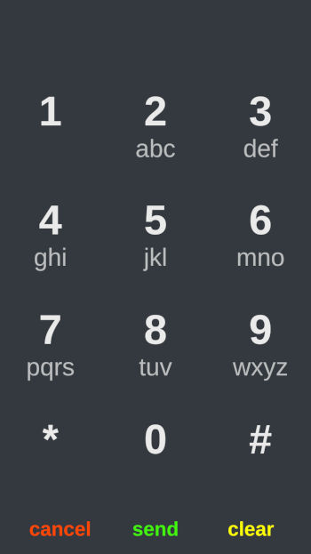

Make and receive calls using [Cloudflare Workers](https://developers.cloudflare.com/workers/) and [Twilio](https://twilio.com/).

## Resource Requirements
* A Cloudflare account with workers enabled.
* A Twilio account with a phone number.

(Cloudflare is free and Twilio offers a free trial account with enough credit to "buy" a test number.)

This tutorial isn't pixel perfect, your experience may vary slightly but hopefully you find the following provides guidance in reaching the goal of installing your own web phone.

These are your ultimate goals...

## Goals
* Cloudflare account with workers enabled.
* Twilio account with a phone number with empty web hooks (ie empty A CALL COMES IN and A MESSAGE COMES IN url fields.)
* Collect the following credentials...
1. Cloudflare Account Id
1. Cloudflare Edit Worker Token
1. Twilio Account SID
1. Twilio App SID
1. Twilio App Secret

So let's get started!..

### Cloudflare
Create a [Cloudflare](https://dash.cloudflare.com/sign-up) account (free tier works, you don't need to add a domain.)

#### Activate workers

Click the Cloudflare logo in the upper left to get to the Cloudflare dashboard

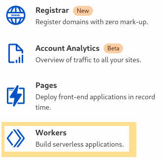

Make up a subdomain (you can change this later)

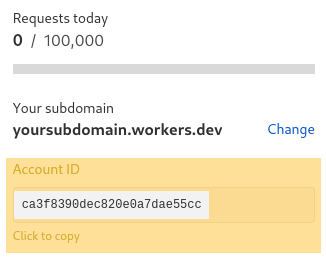

Note your Account ID (we'll need this in the install step)

#### Create a worker token

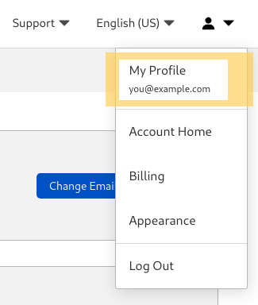
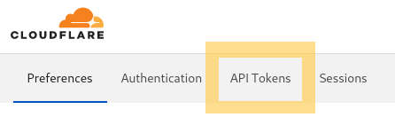

Click **Create Token**

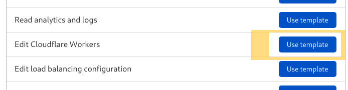

**Permissions Section**
No change to these fields, use the provided values.

**Account Resources:**
All Accounts

**Zone Resources:**
All Zones

**Client IP Address Filtering:**
Leave as is

**TTL:**
Click `Start Date`, select today's date.

Click tomorrow's date to set `End Date`.

Hide calendar (click somewhere on the page) 

**Continue to Summary**

Review settings

**Create Token**

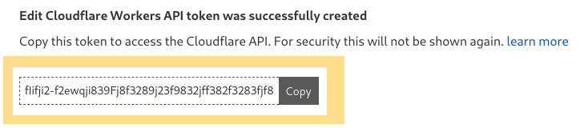

Save this key, we'll use it in the install step.

Next setup Twilio...

### Twilio
Create a [Twilio](https://www.twilio.com/try-twilio) account.

**Note your ACCOUNT SID**

We'll need this in the configuration step.

**Get a phone number**

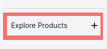
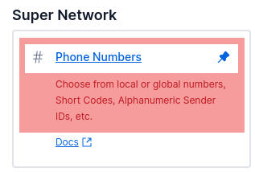

**Buy a number**
Search for and "buy" a number. (This uses your free trial credit.)

**Configure Number**

Clear the web hook urls...

**Voice & Fax**

**A CALL COMES IN**

Clear the 'https://....' field.

**Messaging**

**A MESSAGE COMES IN**

Clear the 'https://....' field.

**Save** changes

**NOTE: the clear web hook steps are important otherwise the phone will not be properly configured during the automatic install step.**

**Create API key**

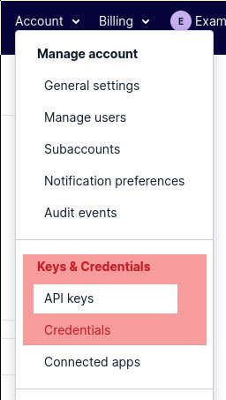

**Create API key**
Provide a `Friendly Name`

**Keytype:** Standard 

**Create API Key**

Record...
* SID
* Secret

We'll need these for the configure step.

Next, install the phone software to your Cloudflare worker...

### Install
Browse to the [Get Ephemerous](https://get.ephemerous.com/) installer.

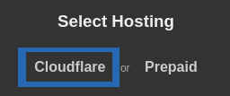

Select the **Cloudflare** hosting option.

Provide your **Cloudflare** account id and worker token.
* Account ID
* Worker Token

**Next**

Wait as Ephemerous is automatically installed to your Cloudflare account (this can take a minute or two.)

### Configure
You'll be forwarded to your new phone url, make note of the `url` and `activation code`.

Provide your **Twilio** account and key information.
* Account SID
* API SID
* API Secret

Select the phone number you'll use for your web phone.

You're all set!

## Bonus Steps

### Activate your phone on another device.

1. From the new device visit your `phone url`.
1. Enter your `activation key`.
1. Click **Activate**

